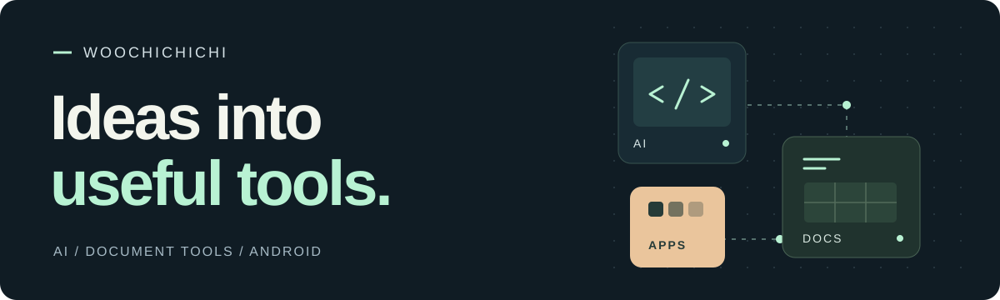
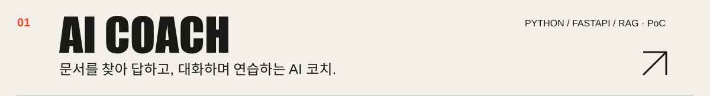
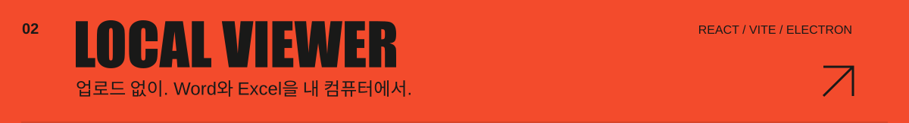
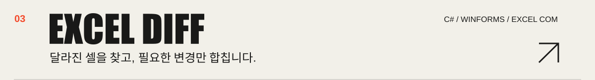
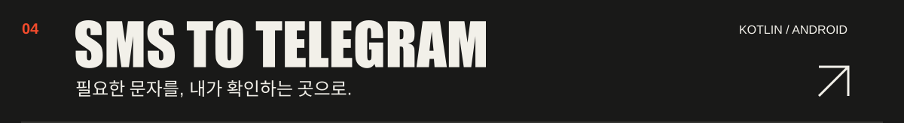
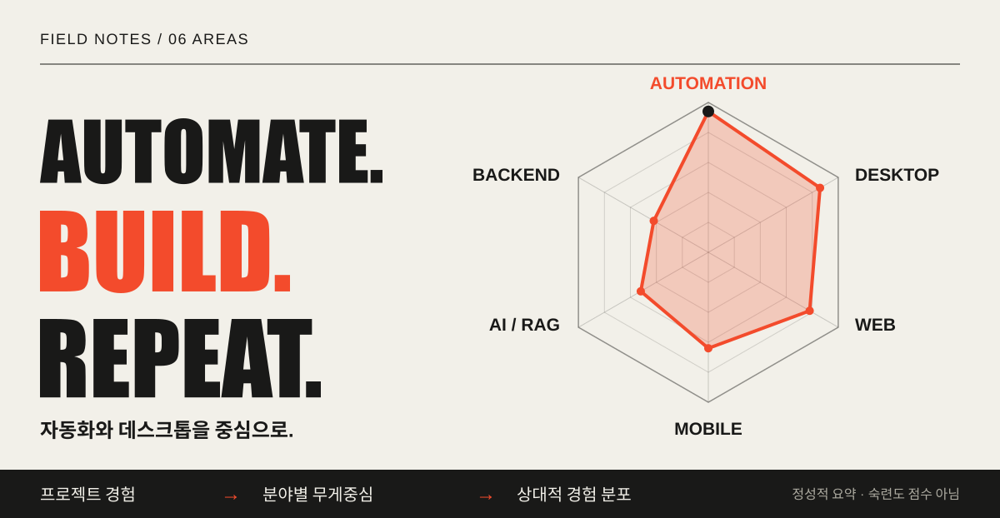
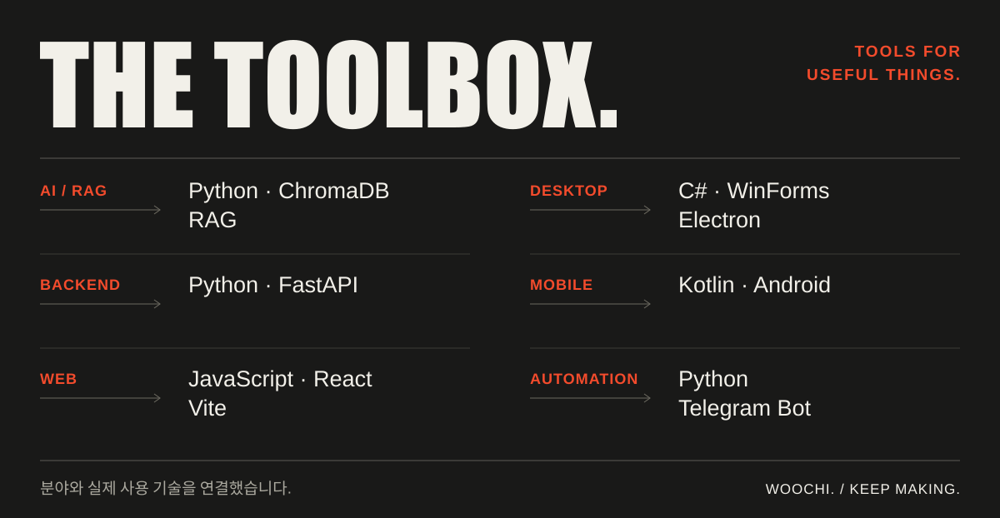

반가워요, **우치**입니다. 반복되는 일을 줄이는 도구와 직접 써보고 싶은 앱을 만듭니다.

[Selected work](#selected-work) &nbsp; / &nbsp; [Field notes](#field-notes) &nbsp; / &nbsp; [All repositories ↗](https://github.com/woochichichi?tab=repositories)

## Selected work

**Also building** &nbsp; [KRX Backtester ↗](https://github.com/woochichichi/backtest_program) — 국내 주식 일봉 데이터로 전략을 살펴보는 백테스팅 도구.

## Field notes

<a href="https://github.com/woochichichi?tab=repositories"><b>More experiments ↗</b></a>

